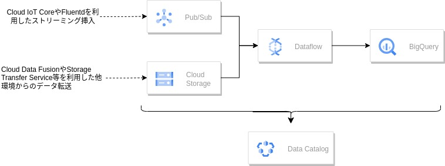
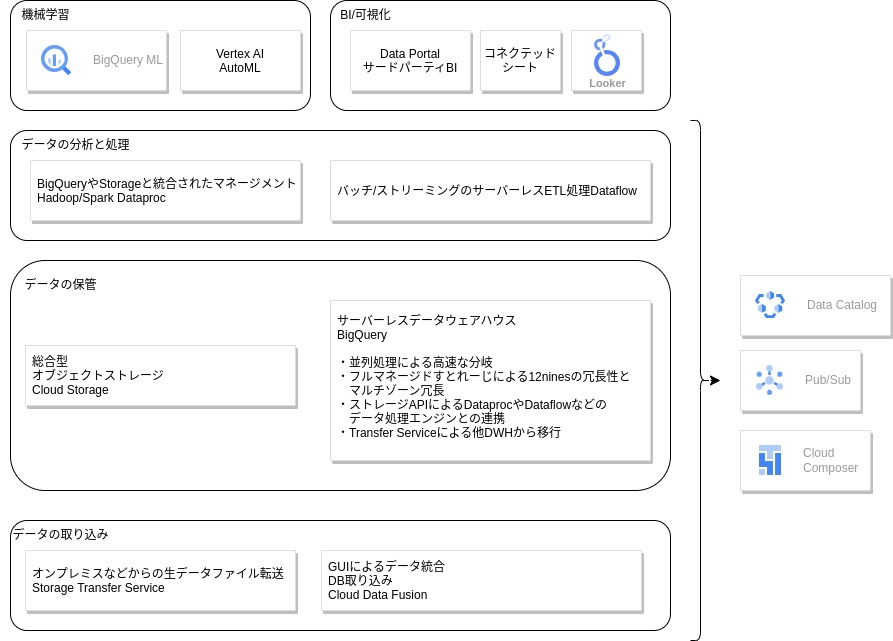

# ビッグデータサービスの概要

## 1.1 ビッグデータ時代に求められるもの

### 1.1.1 デジタル化の波によって爆発的に増えたデータ

データウェアハウス（DWH）などの分析基盤は1990年代から企業に使われてきました。
近年では主に３つの分析が必要となり、データの登録を行われています。

***1.業務のシステム化***

今はあらゆる業務がシステム化され、発生するトランザクション（一連の処理）が増えてきています。（例：POSレジの導入、Eコマース、ERP（統合基幹業務）システムなど）

***2.マーケティング方法の変化***

Eコマースやデジタルマーケティングが進化することにより、自社のWEB上での顧客の動向を基に、よりパーソナライズしたコンテンツや商品を届けられるようになりました。こうした変化があり、基幹系システムやEコマースと統合したデータ分析をしたいというニーズが高まりました。

***3.企業のビジネスのデジタル化***

あらゆる企業が、ビジネスモデルをIoT,AI、VRなどを使用してデジタル化することにより企業が扱うデータの種類は爆発的に増えています。

## 1.1.2 現在のデータ基盤に求められる要件

時代とともにデータ基盤に求められる要件も変化してきています。
たくさんの種類のデータが得られるようになったことから、データの種類を把握して正しい分析を行いたいという要求、機械学習などを使った売上着地のの将来を予測したいといった要求など不確実性がたま買ってきています。そのためビジネス施策をアジャイルに回し、検証、修正のサイクルを回せるように修正を前提とした短いスパンでの分析も求められています。

## 1.1.3 ビッグデータ処理に必要なテクノロジー

巨大化するデータを様々なビジネス要求に対応するために様々なテクノロジを活用します。
|要求|解決するテクノロジ|
|---|---|
|施策の結果を素早く検証し、ビジネス施策を修正したい|ストリーミング|
|将来を予測したい|機械学習|
|データの種類を把握して、正しく活用したい|データガバナンス|
|フレキシブルな投資をしてデータ分析の効果を確認したい|柔軟なコスト管理やスケーリング|
|巨大なデータを分割せず、データを蓄積する|スケーラブルなストレージ|
|巨大なデータから小さいデータまで、様々な方法で柔軟に分析する|柔軟なクエリ構築|
|データを可視化する|Business|

## 1.2 Google Cloundで提供されるビッグデータ関連サービス

### 1.2.1 データ分析アーキテクチャのベストプラクティス

Google Cloudにおいてビッグデータを検索したり分析したりできるサービスが「BigQuery」です。
そこで分析したいデータは、いくつかの方法でBigQueryへと取り入れる必要があります。
ベストプラクティスとされている基本的なアーキテクチャパターンは、Dataflowを使ってBigQueryへと投入するやり方です。

***Google Cloud上でのクラウドネイティブなデータ分析アーキテクチャー***
 

#### **1.入力データ**

入力データとしては、IoTデバイスやログ収集システムのFluentdなどから送られてくるデータなどリアルタイムデータとファイルなどから取得する非リアルタイムデータに分けられます。

リアルタイムデータの場合は、[Pub/Sub]というサービスを使って取り込みます。
非リアルタイムデータは「Cloud Storage」という汎用ストレージにファイルとして配置します。CSV形式ファイルなどを直接置くこともあれば、別のDBに接続して中にあるデータを変換して取り込むCloud Data FusionやStorage Transfer Serviceなどの別のサービスを前段において変換後のファイルを配置するという方法もあります。

#### **2.データの加工**

１のデータを加工してBigQueryに転送するのが、Dataflowです。BigQueryに転送する際のデータの変換、マージなどをします。

#### **3.データ分析**

実際にデータの分析を行うのでBigQueryです。サーバーレスのデータウェアハウスサービスであり、ビッグデータを処理する中心的なサービスです。

#### **４.検索と活用**

Pub/SubやCloud Storage内のメタデータやBigQueryの結果を組み合わせて、様々な情報を取得するにはData Catalogを使用します。ビッグデータの検索エンジンのような役割です。

### 1.2.2 企業におけるデータ活用に対応したGoogle Cloudサービス
場合によってはオンプレミス環境から取り込むや分析結果を機械学習にかけるといったこともあります。
そういった場合も例に上げています。

#### **データの取り込み**

データをデータ分析基盤に取り込む機構です。
取り込みの段階で整形できるものは整形します。
この一連の処理を「Extract(書き出し) Trancform（整形）Load（取り込み）」の頭文字をとって「ETL」と呼びます。
GCPでは以下のサービスが該当します。

- Storage Transfer Service
    
    オンプレミス環境や他クラウドからのデータ転送をするためのサービスです。

- Cloud Data Fusion

    各種DBやストレージと接続するためのコネクターや、ETLを実行するGUIなど、様々な機能を備えたデータ統合サービスです。
    GUIだけでETL/ELT(Extract, Load, Transform)を実行するJOBの作成ができます。

- BigQuery Data Transfer Service

    BigQueryが備える、様々なデータソースからインポートする機能です。
    Youtube、GoogleAdsなどGoogleの他サービスやGoogle Storageから定期的にデータを取り込むことが可能です。
    AWSのS3やRedshiftなどからのデータ移行や定期データ転送も対応可能です。

- BigQuery外部データソース

    BigQueryのクエリーエンジンを使って、外部データソースに対してクエリを実行できる機能です。
    インポート機能と違いデータをBigQueryに取り込まずに分析ができます。
    詳細はドキュメントを参照
    https://cloud.google.com/bigquery/docs/external-data-sources?hl=ja

#### **データの保管**

データを一時的または長期的に保管する機能です。
画像や音声などの非構造化データはオブジェクトストレージに保管し、構造化データはDWHに保管するのが一般的です。
GCPでは以下のサービスが該当します。

- Cloud Storage

    総合型のオブジェクトストレージです。主に非構造化データの保管に使います。Dataflowで処理するデータの保管場所として用いたりします。BigQueryの外部データソース機能を使用すればCloud Storageに保管されているCSV形式やJSON形式などの構造化データに対してクエリを実行できます。

- BigQuery

    BigQueryはサーバーレスのDWHですが、内部にストレージをもっており、データ保管でも大きく役割を果たします。
    DWHには、コスト面やパフォーマンス面の制約などから、分析に使いやすい形に整形したデータのみを保管するケースが多いですが、BigQueryはストレージとコンピューティングが分離されており、ぞれぞれ別々に拡張が可能なため、制約を気にしてデータを整形する必要がありません。
    ストレージAPIを使えば、ストレージに直接アクセスすることもできます。別のデータ処理エンジン（DataprocやDataflowなど）やPythonのデータ解析ライブラリからもクエリを介さずに高速にBigQueryのストレージアクセスできます。

#### **データの分析と処理**

データの分析と処理には、次のようなサービスを使います。

- Dataproc
    HadoopやApache Sparkを使ったデータ分析を実行するマネージドサービスです。
    Cloud StorageやBigQueryをデータソースとして用いるコネクターが提供されており、既存のジョブには手を加えず、一部処理だけBigQueryに移行するといったこともか可能です。
    > Apache Hadoop と Apache Spark は、分析用の大量のデータを管理および処理するために使用できるオープンソースフレームワークです。

- Dataflow
    サーバーレスの大規模データ処理サービスです。
    1 つ以上のソースからデータを読み取り、変換し、宛先に書き込むデータ パイプラインを作成します。
    ストリーム（随時処理）とバッチ（一括処理）の両方のモードがあります。
    Google Cloudのメッセージングサービス「Pub/Sub」に流れるストリーミングデータとBigQueryなどに保管されたマスターデータをリアルタイムに結合し、集計することもできます。
    https://cloud.google.com/dataflow/docs/overview?hl=ja

- BigQuery
    BigQUeryでは外部データを取り込めるため整形済みの分析用データを内部に保存する必要はありません。
    スケーラビリティーが高く手軽に利用できることから、まず半構造化データをロードして、そこからELTを実行するやり方も広く使われています。データを整形した後はSQLで分析します。

#### **BI, 可視化**

BigQueryに保存されているデータは、GUIで可視化できます。定形レポーティングや多次元分析、ドリルダウンなどを実行できます。

> ドリルダウンとは、データの集計レベルを１つずつ掘り下げて集計項目をさらに詳細にする操作のこと。

- コネクテッドシート
    Google スプレッドシートには、BigQueryと直接接続して高速に分析を実行する機能があります。
    BigQueryのデータをピボットテーブルやスプレッドシートの関数を利用して分析できます。

- Data Portal
    無料で利用可能なダッシュボードやレポーティングの機能を持つツールです。
    BigQueryやCloud SQL, Cloud Spannerなどをバックエンドとして利用し、データを表示できます。
    また、BigQueryに組み込まれたインメモリー分析エンジン「BigQuery BI Engine」を利用することで、高速なフィルター適用なども可能になります。

- Looker
    Data Portalと比較してエンタープライズBi用途に特化しています。BigQuery BI Engineにも対応しています。

- サードパーティーのBIツール
    TableauやPowerBi等Google以外のBIツールにもBigQueryに対応しているツールがあります。

#### **メタデータ管理とデータガバナンス**

Google Cloudでは、メタデータ管理やデータガバナンス確保のための機能も提供しています。
メタデータとは、データそのものの意味や属性などを定義したものです。（DBだとスキーマ名やカラム名、型などのこと)
データガバナンスとは、メタデータなどに基づいてデータ管理を統制することを指します。(取得から、その使用および廃棄に至るまでのライフサイクルにわたって、データを管理するための原則に沿ったアプローチ)
こうした機能を使うことで、企業内で価値あるデータを整理して活用を促したり、管理を厳格化したりできるようになります。

- Data Catalog
    スケーラブルなメタデータ管理サービスです。
    BigQueryやPub/Subのテクニカルメタデータを自動で取り込むほか、オブジェクトストレージであるCloud Storageの中に蓄積した情報を整理して検索可能にします。

- バッチスケジュール管理
    特定の条件に合うデータをバッチで取り出す、データを統合する、データを取り込むといった際に、複数のジョブカンの依存関係の管理が必要になることがあります。例えばジョブA、Bが完了してからCを実行するというケースです。
    このようなときにスケジューラーを利用することで、依存関係を管理しながらバッチジョブ全体の状況を管理しらり、リトライを設定したりできます。