# 2.BigQueryを体験する

BigQueryがどういったものか触れておきます。

## 2.1 プロジェクト作成

BigQueryを利用するプロジェクトを作成します。

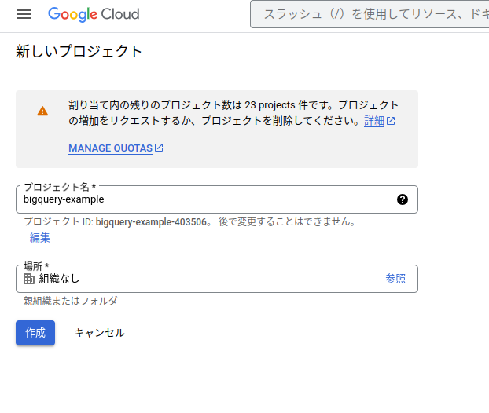

## 2.2 GitHubリポジトリのアクティビティを参照する

一般公開データセットから「GitHub Activity Data」というデータセットを参照してみます。
GitHubリポジトリアクティビティが含まれているビッグデータです。
> 一般公開データセットは、BigQuery に保存され、Google Cloud 一般公開データセット プログラムを通じて一般提供されているデータセットです。この一般公開データセットは BigQuery でホストされ、ユーザーがアクセスして独自のアプリケーションに統合できます。Google では、これらのデータセットの保存費用を負担しており、プロジェクトを介してデータへの公開アクセスを提供しています。データで実行したクエリにのみ料金が発生します。

1. BigQueryのコンソール画面を開く

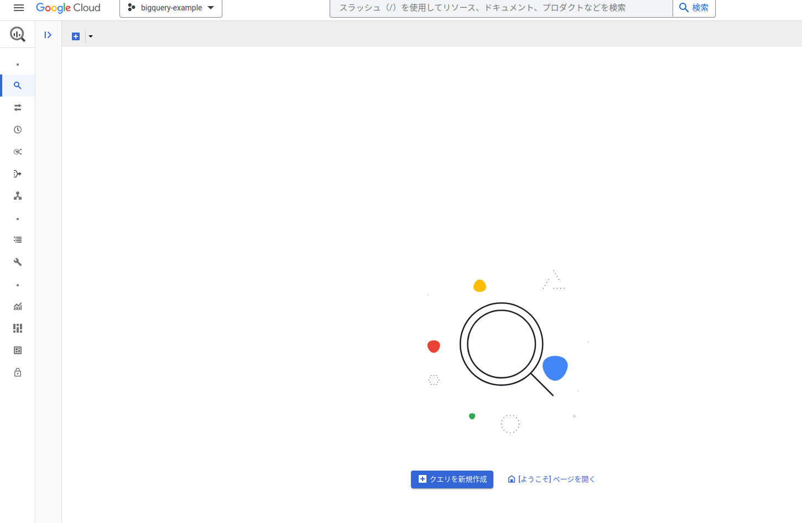

1. 一般公開データセットを追加する

左のメニューから「追加」を押下

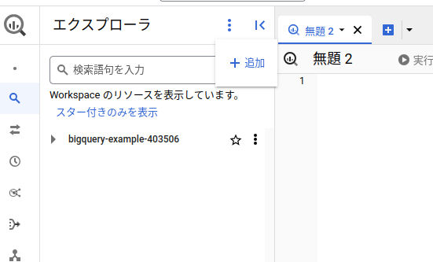


「公開データセット」を選択
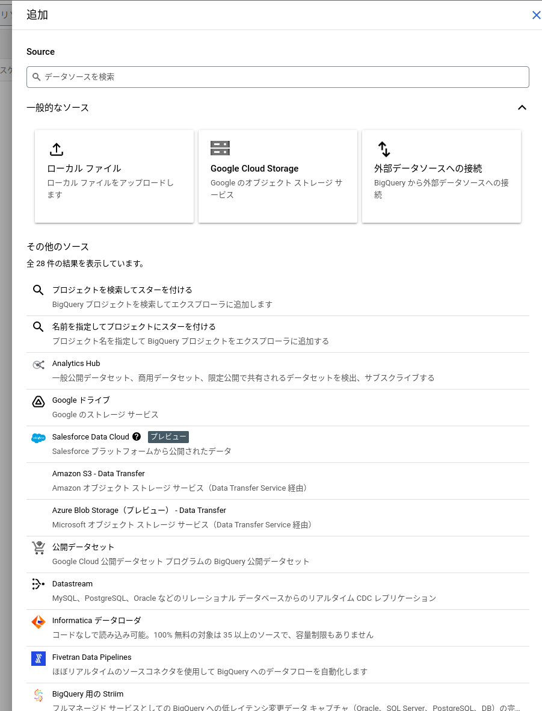

Marketplaceで`GitHub Activity Data`を検索して`GitHub Activity Data`を押下

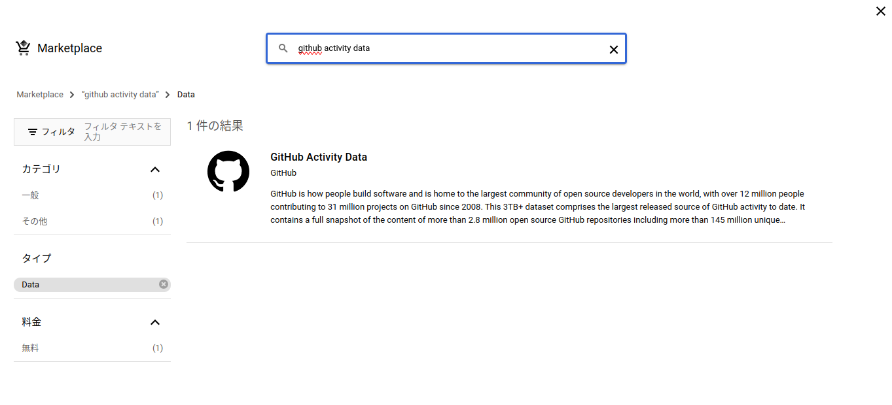

データセットを表示を押下
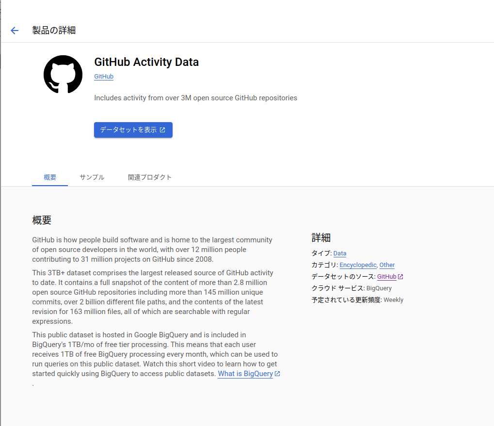

## 2.3 BigQueryのコンソール画面の基本的な使い方

ここまでで`GitHub Activity Data`が参照できるようになったので、コンソール画面の基本的な使い方の説明になります。


## 2.3.1 サイドバー

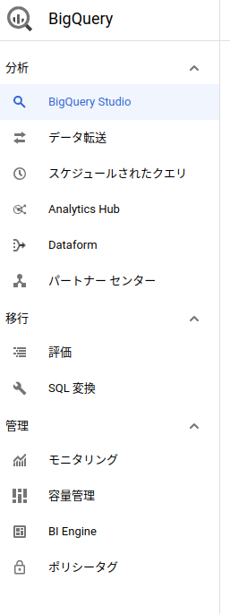

***データ転送***

他のソースからBigQueryにデータ転送します。

***スケジュールされたクエリ***
BigQueryに内蔵されているクエリの定期実行機能を管理します。

***予約***
 BigQueryのコンピュートリソースを事前に購入します。

***BiEngine***
インメモリー分析エンジンであるBigQuery BI Engineを管理します。

## 2.3.2 リソース

BigQueryでは扱うデータを「リソース」として管理します。
リソースは「プロジェクト」「データセット」「テーブル」として、階層構造で管理されておりエクスプローラに表示されています。

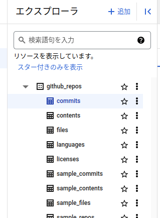

***プロジェクト***
GCPを開発や部署などでわけた環境

***データセット***
テーブルの集合体。RDBでいうスキーマ。

***テーブル***
データのテーブルです。

## 2.4データプレビュー

BigQueryではSQLを使ってビッグデータにアクセスするのが基本です。
SELECT文などを書いて中身を書いて確認します。

BigQueryの規定はオンデマンド料金モデルであり、クエリが対処にしたデータ容量に対して課金されます。
テーブルの中身を少し確認するのに「SELECT * FROM example LIMIT 10」などとしてしまうと、exampleテーブルの全データに対し処理が実行されてしまいます。

> BigQueryにはスロットと呼ばれる単位でクエリを処理するコンピュートリソースを月単位や年単位で支払う「定額料金モデル」もあります。https://cloud.google.com/blog/ja/products/data-analytics/choosing-bigquery-pricing

1. テーブルを開く
今回は`commits`テーブルを開きました。
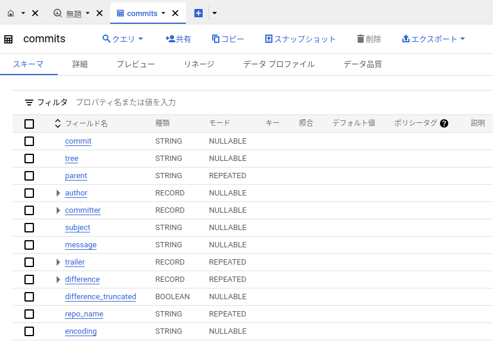

1. プレビューをする
プレビューボタンを押下

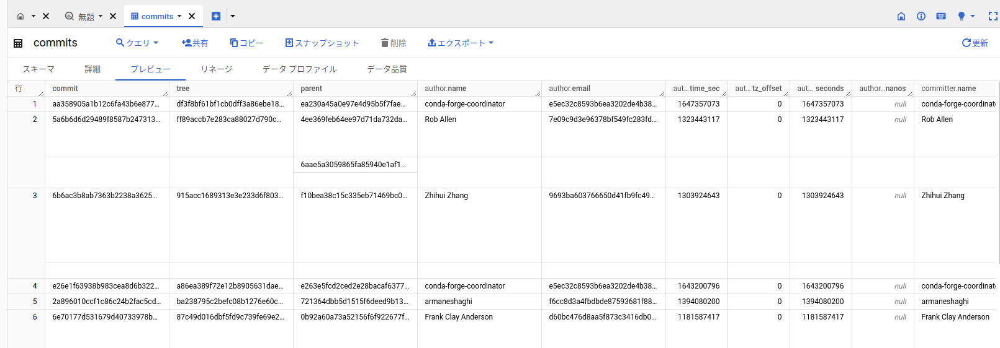

## 2.5BigQueryに対してクエリを実行する

次はBigQueryに対してクエリを実行してみます。
SELECTクエリを実行します。

> 無料トライアル中であれば無料の範囲でクエリの実行がされます。

1. クエリウィンドウを表示
クエリを押下してクエリウィンドウを表示

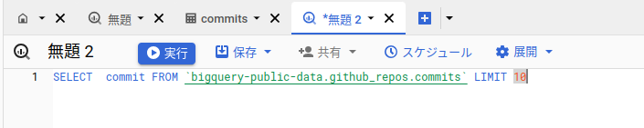

2. 実行
実行を押下

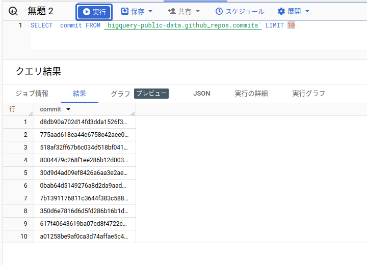

## 2.6 WHERE句を指定した複雑な集計

今度は`where`句を使用して実行します。

```sql
SELECT subject, COUNT(subject) FROM `bigquery-public-data.github_repos.commits`
WHERE author.email LIKE "%@gmail%"
GROUP BY sunject
ORDER BY COUNT(subject) DESC
LIMIT 10
```

commitsテーブルにあるデータのうちメールアドレスに「gmail」を含むユーザーのコミット数が多いユーザーを上位10件表示です。

実行結果は下記のようになります。


## BigQueryの特徴と魅力

実行結果も下記のように表示されます。
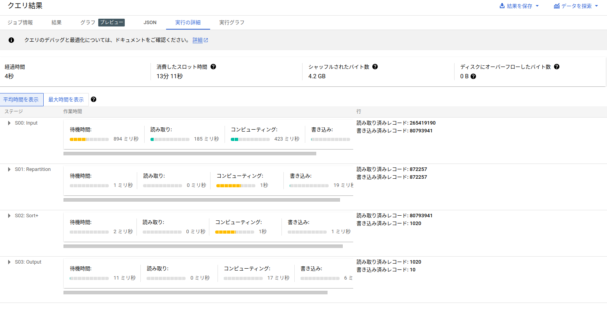

初回には4秒ほどかかってますが、次に実行するとキャッシュが使用され0.1秒ほどで結果が返ってきます。

先程のクエリでは"%@gmail%"という中間一致となる条件式を使いました。
B-treeインデックスの場合こういったクエリはインデックスが効かず取得速度がかなり遅くなりますが、BigQueryではこういったフルスキャンを高速に実行します。
BigQueryではインデックスがないためインデックスの管理する手間も省けます。

