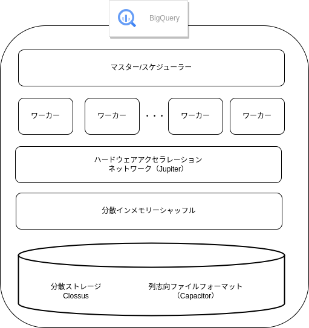
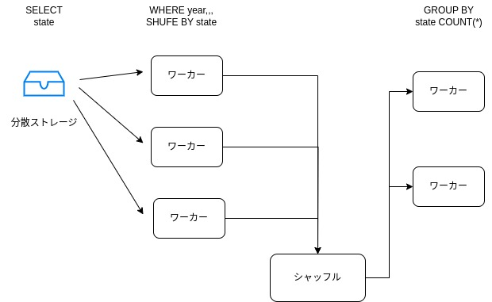
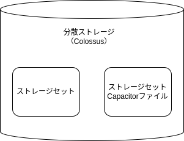

# 3.BigQueryの内部構造

前章ではBigQueryが高速で有ることを確認できました。
この章ではどのように実現しているかみていきます。

## 3.1 Googleの分散処理環境で実行されるBigQuery

まずは一般的なDWHのアーキテクチャとBigQueryの内部のアーキテクチャの構成を比較します。

一般的なDWHでは、ノードなどと呼ばれるものを横に並べてクラスターを構成して並列処理します。

ノードとは、コンピューティングリソース（CPUやメモリ等）とストレージリソース（ディスク）を一体化したものです。

処理を実行するにあたって、リソースの事前準備（プロビジョニング）を実施します。その際に準備するリソースのサイズは、コンピューティングまたはストレージのどちらか大きい方のピークに合わせて決定します。

プロビジョニングとは必要に応じてネットワークやリソースを割り当てることです。

それに対してBigQueryでは、クエリ実行に必要なリソースが、Googleが管理する巨大なクラスターから動的に割り当てられます。
そのため事前のプロビジョニングが扶養で、クラスターをほじるすることによるコストも発生しません。
また、コンピューティングとストレージは分離されているため、それぞれ独立してスケーリングできます。

## 3.2 BigQueryの詳細なアーキテクチャ

細部を見ていきます。
下記の図はBigQueryの詳細なアーキテクチャです。
BigQueryの主要なコンポーネントは、「マスター/スケジューラ」「ワーカ」「分散インメモリーシャッフル」「分散ストレージ」の４です。

※ハードウェアアクセラレーション、ネットワークはワーカーとインメモリーシャッフル、分散ストレージ間をつなぐネットワーク。高速にデータ間のやり取りを行える。

### 3.2.1 マスター/スケジューラー

クエリの構文を解釈し、クエリプランを構築する部分です。
BigQueryにおけるクエリプランは細かいステージに分割され、スロット（ワーカーを実行する単位）の利用量を割り当てられて実行されます。

あるクエリを実行中に並列で別のクエリが届いたときや、新たに利用できるスロットが増えたときにはクエリプランを動的に変更する仕組みになっています。

初期設定におけるクエリの最大同時実行数は1プロジェクトあたり100クエリです。
あくまで推奨値であり、上限値を変更することもできます。

また、同時実行数を変えずにキューイング（他の処理が終わるまでクエリの実行を待たせること）させてたい場合は、「batch」というモードでクエリを実行することで、スロットの空きを待って処理できます。

### 3.2.2 ワーカー

ワーカーはクエリの実行を担う機能です。
クエリプランに基づいて数百~数万ものワーカーによる分散処理を行います。

BigQueryのクエリ処理基盤の実態はコンテナで動作する分散コンピュート環境です。
クエリを実行させた瞬間にワーカーを起動し、終了と同時に破棄するという処理を高速に行っています。
この環境をリージョンごとに設けて大規模な分散処理を行い、インデックスなしでの高速なフルスキャンを可能にしています。

ワーカーのコンピューティングユニットのことを「スロット」と呼びます。クエリを実行している間だけスロットが消費されます。
BigQueryの課金はこのスロットに基づくものです。
スロットとはいわゆるCPUのことです。

どれだけスロットを消費するのかはクエリの実行時に確認できます。

### 3.2.3 分散インメモリーシャッフル

分散処理においては、ワーカー間でのデータの移動処理が発生します。これを「シャッフル」と呼びます。

データを分散処理で取り出した後に「GROUP BY」で集計する際に特定のワーカーに特定のキーを寄せる必要があります。
こうした処理ではワーカー数やキー数が増えれば増えるほどデータ移動が発生するため、ネットワーク負荷が大きくなるのとワーカーに障害があった際にはそのデータが消失しジョブが失敗するなどのトラブルになります。

BigQueryではこうした課題を解消するため、シャッフル処理をワーカーではなく、巨大な分散インメモリーシャッフル基盤で実行します。
こうすることでネットワークの負荷を抑え、特定のワーカーが障害にあっても動作を継続します。

分散インメモリーシャッフル基盤にシャッフルを委託することで、ワーカーの利用数も少なくて済み、高速な分散処理と高可用性も実現しているのです。

### 3.2.4 分散ストレージ

BigQuery上のデータは、複数のゾーンに自動的に複製され、保管されます。

同じデータを複数のゾーンで補完することで、非常に高い耐久性を実現しています。
データ容量やIOに応じて自動でスケーリングされるため、ストレージの追加や縮小の手間もありません。

分散ストレージ内部では列指向のファイルフォーマットでデータを圧縮し、保管しています。
このファイルは「Capacitorファイル」と呼ばれ、列方向でデータをまとめて扱います。
スキャンの容量は選択したカラムの数に応じて変化します。
クエリを実行する際には必要なカラムのみを選択して実行をするのが良いです。

BigQuery上では、複数のCapacitorファイルを束ねてテーブルとして表示しています。