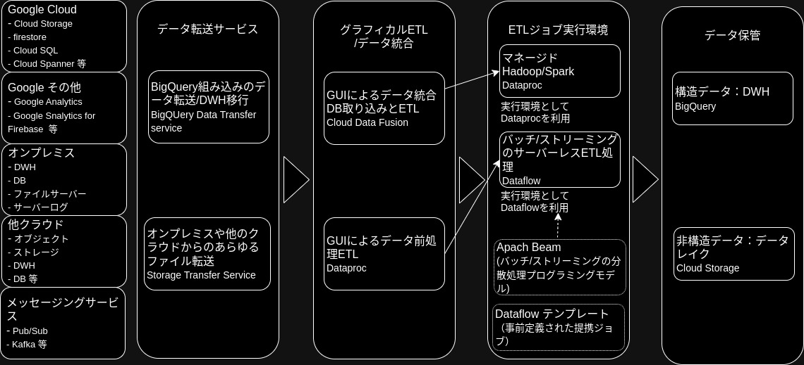
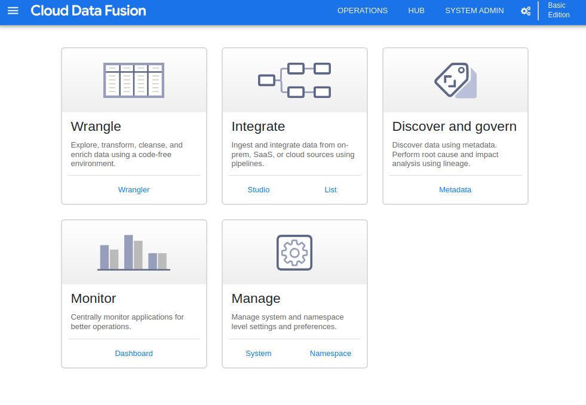
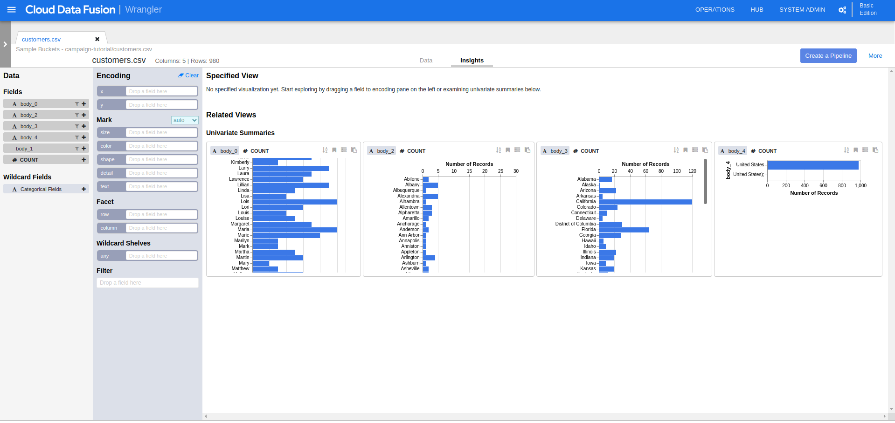
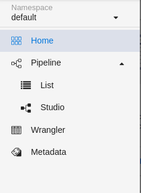
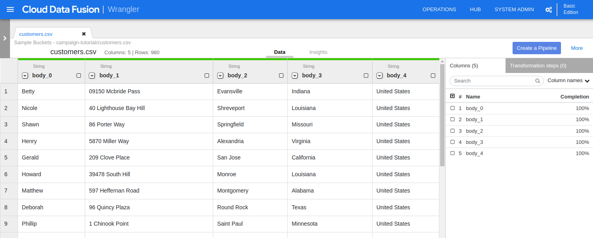

# 5.BigQueryへのデータ取り込み

BigQueryでは、様々なデータを取り込むことができます。
この章では、各種データを取り込んだり、変換したりする方法について説明します。

## 5.1データ基盤におけるデータ取り込み、データ変換

「1.2 Google Cloudで提供されるビッグデータ関連サービス」で説明した通りデータ基盤へのデータ取り込み、データ変換にはGCP上の様々なツールを利用できます。

中心となるのは4つのサービスです。

1. Dataflow
Dataflowは、サーバレスETL(データの書き出し・整形・取り込み)サービスです。

2. Dataproc
Hadoop/Sparkのジョブを実行できるマネージド環境です。

> Apache Hadoop と Apache Spark は、分析用の大量のデータを管理および処理するために使用できるオープンソースフレームワークです。

3. BisQuery Data Transfer Service
BigQueryに付帯するデータの転送サービスです。

4. Transfer Service
オンプレミス環境や別のクラウド環境から、Cloud Storageにデータを取り込めるサービスです。

## 5.1.1 代表的な７つの取り込み手法

### Dataflowを用いる方法

Dataflowを使う場合、取り込むデータの複雑さや性質に応じて、次のような手法をとれます。

(1)Dataflow + Dataflowテンプレート
Dataflowテンプレートは、ジョブをテンプレート化する機能です。
「Pub/SubのメッセージをBigQueryに逐次格納するテンプレート」「JDBCからBigQueryへデータ転送するテンプレート」など、様々なデーテ転送するテンプレートが提供されています。
GUI,CLI,APIからすぐに実行できます。

(2)Dataflow + Cloud Dataprep
Cloud Dataprepは、GUIで操作してジョブを作成できるサービスです。
Cloud Storageに存在するデータに対して、複雑なバッチのETLを実行する際に便利です。

(3)Dataflow + Apache Beam
Dataflow + Apache Beam
Dataflowでは、オープンソースのETLプログラミングモデルである「Apache Beam」によるコードを、ジョブとしてサーバーレスで実行できます。
Apache Beamでコーディングをすることで、ストリーミングとバッチの両方に対応できます。

### Dataprocを用いる方法

(4)Dataprocのみ
Hadoop/Sparkジョブを使ってデータを取り込みます。既存のHadoop/Sparkがある場合はそのまま使用できるため有効です。

(5)Dataproc + Cloud Data Fusion
Cloud Data Fusionは、GUIベースでETLを生成できるオープンソースソフト「CDAP」のマネージドサービスです。

>CDAPはデータ分析で必要なETLおよびELTのパイプラインを効率的に構築できるオープンソースで提供されているデータ統合サービス

### BigQuery Data Transfer Serviceを使う方法
BigQuery Data Transfer Serviceは、データをBigQueryの内部に取り込む方法です。

(6)BigQuery Data Transfer Service
BigQueryに付帯するデータ転送サービスで、オブジェクトストレージから、整形済みの「CSV」 「JSON」 「Avro」などを取り込めます。
DWHからデータを取り込む際は、スキーマが自動で取得され、テーブルが構成された後に転送が始まります。
既に構造化されたデータをBigQueryに取り込んだり、DWHを移行したりする際に有用です。

### Transfer Serviceを用いる方法
画像を含むデータを、Google Cloudで構築したデータ基盤に転送したい際に有用です。

## 5.1.2 取り込み手法の特徴と比較
ここまでに挙げた７つの取り込み手法の特徴です。

## 5.2 Cloud Data Fusionを使った取り込み例
実際にデータの取り込みを行ってみます。
データをGUIから取り込み、整形処理やJOINなどまで行えるCloud Data Fusionを例に解説します。

### 5.2.1 Cloud Data Fusionを利用したETL構成
Cloud Data Fusionを起動すると、画像のようにに表示されます。

データを取り込むには「Wrangler」を使ってデータを調査し、必要な変換・マッピング、クレンジングなどのジョブを作成します。
それから「Pipeline」に、そのジョブを取り込んで実行します。

### 5.2.2 CLoud Data Fusionの機能

①Wrangler
Wranglerは、GUIを使ってデータの探索、変換、マッピング、クレンジング等ができる機能です。
構成したデータ変換やマッピングなどのジョブは、Pipelineに組み込むことができます。

下記の画像はcsvファイルのデータを構造化したものになります。
WranglerではCSVの変換やカラム名をGUIで作成することができます。

また、Insightsに切り替えればデータの傾向を確認することもできます。
このグラフは設定を自由に変えることができます。

②Pipeline
Wranglerを使ってデータのクレンジングが完了し、データを構造化して格納できたら、ETLパイプラインを作成します。
Pipelineは、ETLパイプラインを管理する機能です。
「Studio」がETLパイプラインを管理する機能です。