# 6.Data Catalogを用いたメタデータの管理

## 6.1 メタデータを管理するData Catalog

メタデータとは、データの意味を表すデータのことです。
メタデータを管理することにより、データは整理・探索可能にまります。

Data catalogを利用すると以下のことが可能になります。

### データの意味の把握
メタデータをタグとして整理することで、データの意味をすぐに把握できるようになります。

### 検索と検出
データレイクに保管したデータに対し、タグによる構造化探索検索とGoogleの検索技術による検索を利用できます。

### セキュリティーとコンプライアンス対応
アクセス管理機能の「IAM」と機密データ管理の「Cloud Data Loss Prevention 」との統合によって気密性が高いデータを仮名化・匿名化した状態で分析利用可能にします。


「Cloud Data Loss Prevention」は機密データをGoogleの機械学習モデルによって分類・検出し、秘匿化できるサービスです。

## 6.2 BigQueryで付与するメタデータとData Catalogによる管理

メタデータをつけるには、BigQueryでつける方法とData Catalogでつける方法とがあります。

## 6.2.1 BigQueryにおけるメタデータの付与
BigQueryには、データセット、テーブル、カラムのそれぞれにメタデータをつける機能があります。
この機能を使うと、ユーザーが簡単にデータの中身に対して説明を付与できます。

## 6.2.2 Data Catalogのテンプレートによるメタデータの付与
Data Catalogでは、「テンプレート」と呼ばれる仕組みを使ってタグを管理します。
メタデータをつけたい時は、メタデータの名称やデータ方などを指定したテンプレートを作成し、そのテンプレートを適用したいテーブルやカラムに対して指定します。

## 6.2.3 Data Catalogによるメタデータの検索・整理
付与したメタデータは、すべてDataCatalogを通じて、検索・整理可能です。
データの利用者はデータの中身や利用方法を正しく把握でき、管理者はタグを使ってデータを管理できます。

例えば、特定のカラムに「これは個人情報である」とか「データ管理者はAである」というタグをつけをしておけば誤ってデータが流通したときに個人情報をタグから検出したり、データの管理者を迅速に調べたりできます。


## 6.3 メタデータを用いてタグ付けする

具体的にメタデータを用いたタグ付けを体験していきましょう。
次の２つをの操作を試します。

1. BigQueryにおいて、カラムに対して説明をタグ付けする。
2. Cloud DLPという機密データを自動検出するサービスを使って、データから気密情報と思われる部分を抽出し、それをData Catalogで整理します。

### 6.3.1 説明文をつけたテーブルを作成する

まずはテスト用のデータを作成します。
あとでCloud DLPを使って気密情報を検出させたいのでここではわざとメールアドレスのような個人情報を含むデータを作ります。


1. データセット作成

BigQueryにデータセット「contract_db」を作成

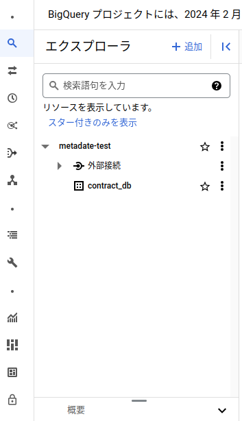

2. メタデータをつけたテーブルを作成

下記クエリを実行して「contract」テーブルを作成します。

```sql
CREATE TABLE contract_db.contract (
    contract_id STRING, email String, postal_code String, sign_up_date Date, status INT64
)

OPTIONS (description="契約DBのサービスAのデータを格納したテーブル");
```

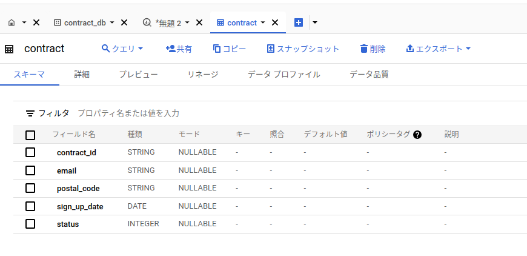

4. テストのレコード挿入

contractテーブルができたら、テストのレコードを挿入します。
```sql
INSERT contract_db.contract(contract_id,email,postal_code,sign_up_date,status)
SELECT * 
FROM UNNEST([('G000001','test1@example.com','000-0001',DATE(2020, 01,01),0),
('G000002','test2@example.com','000-0001',DATE(2020, 02,01),1),
('G000003','test3@example.com','000-0001',DATE(2020, 03,01),2),
('G000004','test4@example.com','000-0001',DATE(2020, 01,02),4)]);

```

### 6.3.2 スキーマからメタデータを設定する

テーブルを作成するときに`OPTIONS (description="契約DBnoサービスAのデータを格納したテーブル");`を指定することでメタデータを設定しました。
それ以外にもBigQueryのスキーマ編集画面でメタデータを変更することができます。

1. スキーマを編集

エクスプローラから「contract」テーブルをクリックして開きます。
その後「スキーマ」タブをクリックして開き、「スキーマを編集」をクリックします。

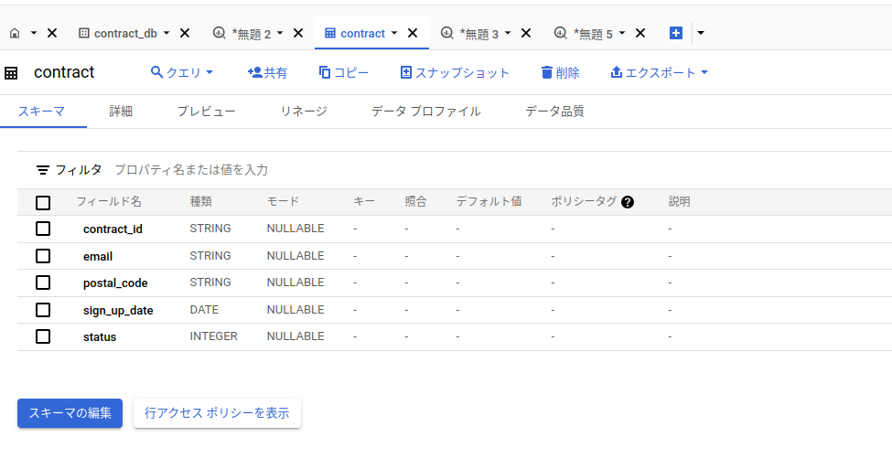

2. 説明を追加する

「説明」に追加することでメタデータを設定できます。

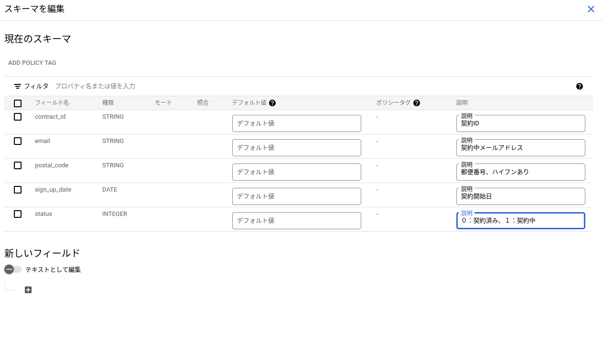

## 6.4 設定されたメタデータを確認

次にData Catalogを操作して設定されたメタデータを確認してみましょう。

1. Data Catalogを開く
画面左のナビゲーションメニューから「ビッグデータ」にある「Data catalog」を開きます。

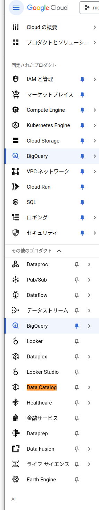

2. メタデータを検索
Data Catalogのコンソールのトップページには、検索ボックスがありメタデータを検索できます。
「契約」という文字列を検索をしてみましょう。

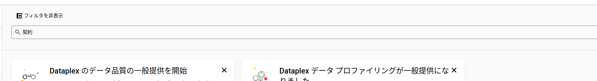

3. メタデータが見つかった

結果としてcontractテーブルが見つかりました。

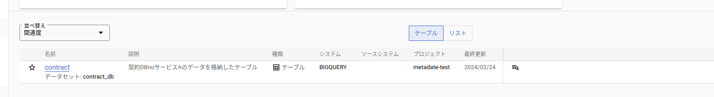

今回はテーブルでしたがスキーマの説明も検索できます。
適切なメタデータをつけておくことで、データの分析感や開発者などが「あるデータは、どこにあるのだろうか」という検索がしやすくなるわけです。

## Data Catalogテンプレートでメタデータを設定する

Data Catalogでは、テンプレートを作成することでメタデータを追加できます。

### 6.5.1 タグテンプレートを作成する

1. タグテンプレート作成

左メニューから「タグテンプレート」を選択して、タグテンプレートを開きます。

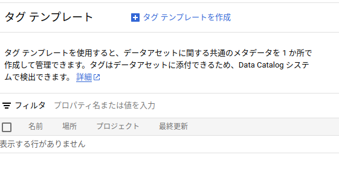

2. テンプレートの表示名とテンプレートIDを設定

テンプレートの表示名とテンプレートIDを設定します。

- テンプレートの表示名：database_table_default
- テンプレートID：database_table_default

ロケーションはテンプレートを配置する場所です。

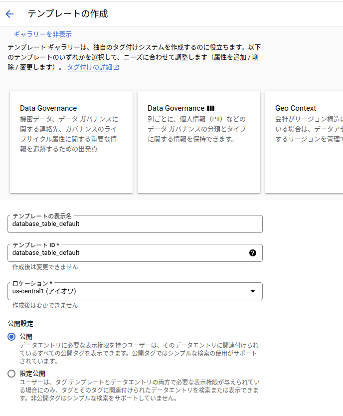

3. 属性を設定

テンプレートに対してフィールドを今回設定します。

フィールドの属性に下記を設定。

- フィールド名、ID：source data host name 
- タイプ：文字列

上記を入力したら「作成」ボタンをクリックしてテンプレートを作成します。

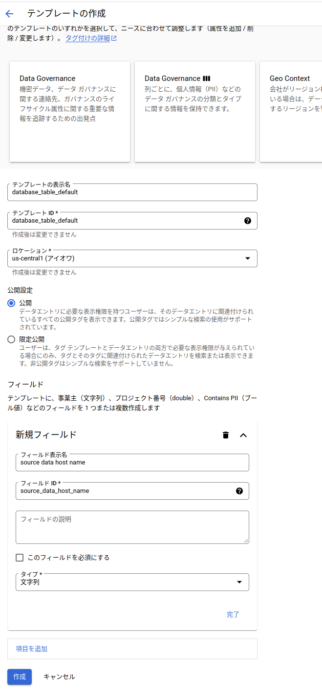


### 6.5.2 タグ付け

作成したタグテンプレートを使って、データセットにタグつけします。

1. 対象のデータセットを探す

Data Catalogでタグをつけたいデータセットを探します。

 「検索」から対象のデータセットを探し選択

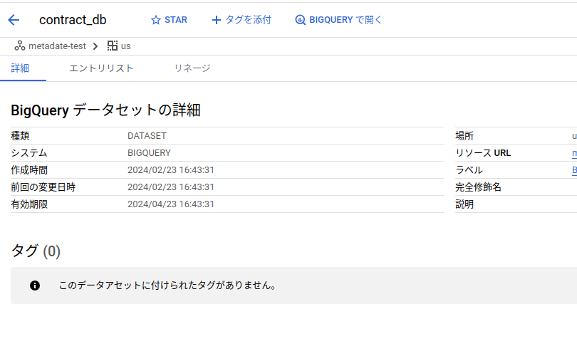

2. テンプレートを選んでタグ付けを始める

「タグを添付」をクリックしてタグをつけるコンソールを表示

対象のタグ添付レートを選択して、入力項目に「contract_db.example.local」を入力

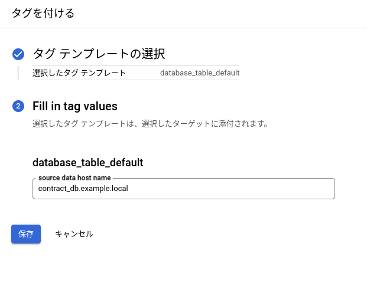

3. タグが設定完了

タグの設定が完了したので検索で「contract_db.example.local」を入力すると検索することができるようになっています。


## 6.6 Cloud DLPと組み合わせて機密性の高いデータをData Catalogで検索できるようにする

機密性の高いデータをData Catalogで検索できるようにする例を紹介します。

機密性の高いデータを探すには、Cloud DLPというサービスを利用できます。
Cloud DLPはGoogleの機会学習モデルによって気見るデータを分類・検出し秘匿化できるサービスです。
Cloud DLPで検知した気密情報をData Catalogで整理することはガバナンスの確保に有効です。

### 6.6.1 DLPでスキャンして機密性の高いと思わしきデータをData Catalogに登録する
機密性の高いと思われるデータをData Catalogに登録してみます。
既に作成してあるcontractテーブルをDLPでスキャンします。
メールアドレスのフィールドが機密性が高いデータとして見つかるはずです。

1. DLPでスキャンを実行
BigQueryでcontract_dbデータセットのcontractテーブルを表示します。
画面右の「エクスポート」から「機密データの保護を使用してスキャン」を選択します。

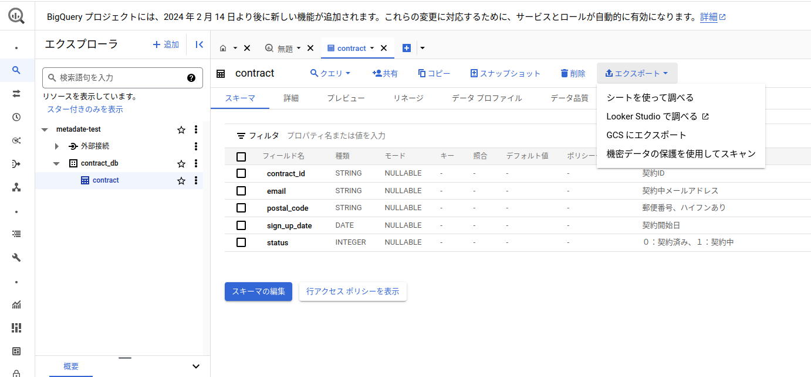

2. 入力データを選択
ジョブIDを入力し、「続行」をクリックします。
今回は「dlp-example」とします。
それ以外の項目はデフォルトのままにします。

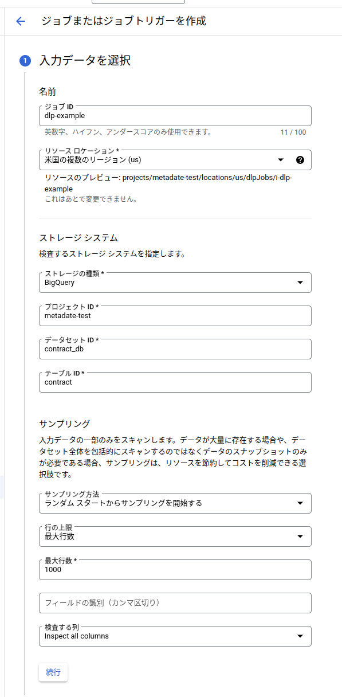

3. 検出の設定

「検出の設定」は、検索方法を指定する画面です。
今回は特に設定はしないため「続行」をクリック。

4. アクションの追加
「アクションの追加」の部分に「Dataplexに公開」という項目をオンにします。
そうすることで見つかった項目がData Catalogに記録されるようになります。

残りの項目はデフォルトのままにします。

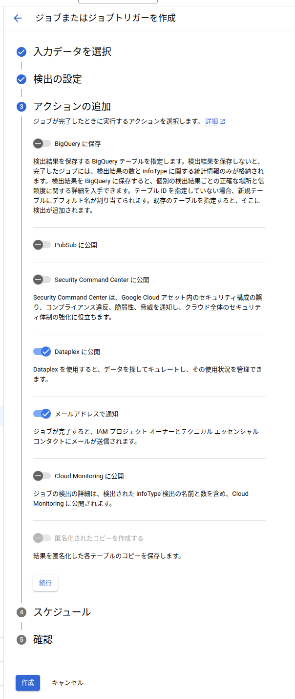

5. 作成の確認
作成をします。


6. 結果が表示される

ジョブが実行され結果が表示されます。

「EMAIL_ADDRESS」と検索すると4件、検出されます。

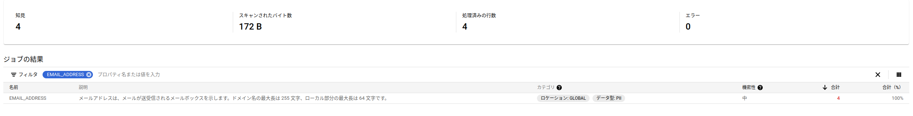

### 6.6.3 Data Catalogで確認
「Dataplexに公開」をオンにしているためこの結果はDataplexのメタデータとして自動的に記録されています。

1. contractテーブルの詳細を確認する

メタデータとして記録されたかを確認します。
Data Catalogを開き「データアセットを探す」の「テーブルとビュー」などからたどって「contract」テーブルを開きます。
「Data Loss Prevention Tags」というタグとして記録されたことがわかります。

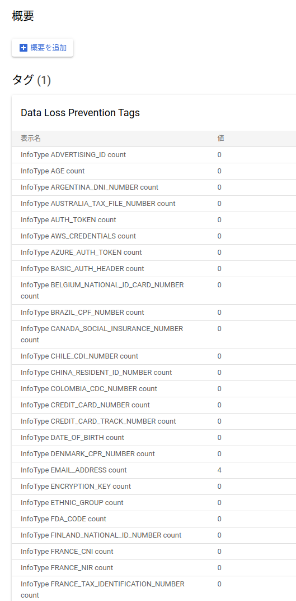

2. 機密データを検索

記録されたメタデータは、Data Catalogから検索できます。
例えば次の検索ワードを空白で区切って入力すると機密情報を持つ可能性がある（tag:has_findings=true）,「契約」という説明文を含む「description:契約」という上kンを満たすデータを検索できます。

tag:has_findings=true
description:契約

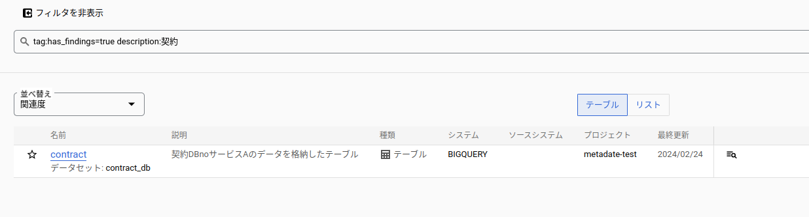

## 6.7 Cloud DLPとData Catalogを活用する
Cloud DLPにはCloud StorageやBigQuery,Cloud Datastoreに機密で０たが格納されていないかをジョブトリガーで確認する機能もあります。
また、APIを通じた機密情報検出や匿名化にも対応しています。

Data CatalogはBigQuery, Pub/Sub, Cloud Storageに横断的に対応しています。
構造化されていないデータもメタデータによる検索や整理をしてCloud Storageに蓄積しておくことでデータ活用がしやすいデータレイクを構築できます。


BigQueryにデータ追加されると自動的にData Catalogと対応付けられるためデータ量が増えてもすぐにデータを検出可能であることもメリットです。
Cloud DLPを用いることでCloud StorageやBigQueryの機密データを検出し自動的にData Catalogに連携することでデータガバナンスを実現できます。


